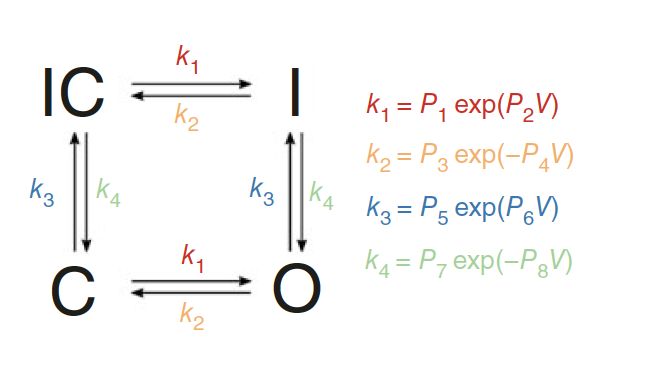
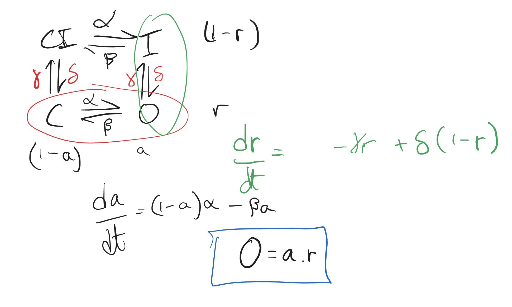

# Daily notes
# Equivalence of Markov models 
Kylies model:  

How about a simpler model? Just the green and red parts. 

~~Read online that the simpler model doesn't have independence on the gates (Inactive comes only form open), and so it doesn't have a HH equivalent.~~ I was comparing the wrong models. 
~~Mean field equations for 3 reations model:~~ I erased since we aren't interested on it anymore.

Update on FEB 14th: need to compare 4 state model to 2 state model (a and r).

Mean field equations for 4 reations model:

$$ \frac{dC}{dt} = \delta CI + \beta O - (\alpha +\gamma)C \\
 \frac{dO}{dt} = \alpha C + \delta I - (\beta +\gamma)O \\
 \frac{dI}{dt} = \alpha CI + \gamma O - (\beta +\delta)I \\
 \frac{dCI}{dt} = \gamma C + \beta I - (\alpha +\delta)CI$$

For the 2 state model:
$$ \frac{da}{dt} = \alpha(1-a) - \beta a \\ 
\frac{dr}{dt} = \delta(1-r) - \gamma r \\ 
O = ar \implies \frac{dO}{dt} = r\frac{da}{dt} + a\frac{dr}{dt} \\
\implies \frac{dO}{dt} = \alpha r +\delta a - (\alpha +\beta + \delta +\gamma)O$$

Ok, not exactly the same... what's? happening?

